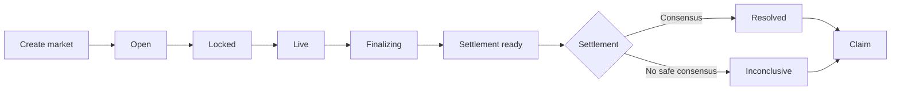
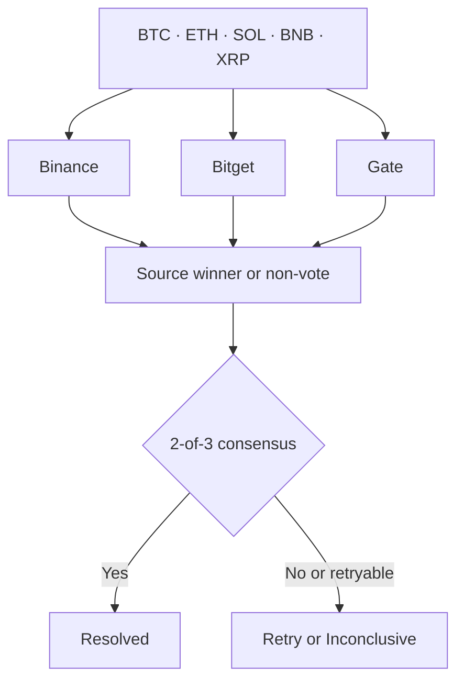

# Crown

Crown is a permissionless 4-hour crypto relative-performance prediction market
on GenLayer. Users predict which of BTC, ETH, SOL, BNB, or XRP will have the
highest percentage return over the same exact 4-hour UTC window. Anyone can
create a valid future market, users stake GEN pari-mutuel style, and settlement
uses independent data from multiple exchange sources.

## Vision

Crown started from a simple observation: short-term crypto markets are rarely
viewed in isolation. Traders compare which asset is leading, which is lagging,
and where relative strength is emerging. Most prediction markets ask whether a
single asset will move up or down; Crown asks which asset performs best over the
same exact window.

By putting BTC, ETH, SOL, BNB, and XRP into one fixed 4-hour race, Crown turns
relative market performance into a simple permissionless prediction market. The
goal is transparent settlement without a trusted operator: fixed UTC windows,
deterministic financial rules, and independent exchange data resolved through
GenLayer consensus.

## How Crown Works

1. A market is created for one canonical 4-hour UTC window.
2. Users back one asset with GEN before betting closes. Each wallet can back
   only one asset in a market.
3. After the window ends, the contract compares every asset's percentage return.
4. Binance, Bitget, and Gate independently determine the top performer. At
   least two valid sources must agree on the same asset.
5. Winning positions share the pool pari-mutuel style. If the result is
   inconclusive, participants claim back their original stake.



## Key Innovations

- **Relative-performance markets:** Five assets compete over one exact UTC
  window; the outcome is the highest percentage return, not an isolated Up/Down
  call.
- **Canonical 4-hour windows:** Every market uses a fixed UTC-aligned candle
  boundary, so all assets share the same start and end conditions.
- **Multi-source settlement:** Binance, Bitget, and Gate independently evaluate
  native 4-hour candles. At least two of three valid sources must agree.
- **Permissionless lifecycle:** Anyone can create a valid market or request
  settlement when ready; users claim their own payout or refund directly.
- **Bounded uncertainty handling:** Temporary source outages can keep settlement
  retryable, while insufficient evidence ultimately becomes `INCONCLUSIVE` and
  enables refunds.

## 4-Hour Market Windows

Crown supports fixed, UTC-aligned windows only:

```text
00:00 → 04:00    04:00 → 08:00    08:00 → 12:00
12:00 → 16:00    16:00 → 20:00    20:00 → 00:00
```

The contract accepts only the 14,400-second duration. A market start must be
in the future, at least 300 seconds ahead of creation, and aligned to a
4-hour boundary. Betting closes 60 seconds before the performance starts.
Settlement becomes available 60 seconds after the performance window ends,
followed by a 1,800-second retry window for temporary source unavailability.

Only one Crown market can exist for an aligned start timestamp. A duplicate
market for that timestamp is rejected.

## Predictions & Staking

- The asset set is fixed: `BTC`, `ETH`, `SOL`, `BNB`, and `XRP`.
- Positions are payable in native GEN. Each position addition must be between
  `1 GEN` and `10 GEN`.
- A wallet's cumulative position is capped at `10 GEN` per market.
- A wallet can choose only one asset. Top-ups are allowed for that same asset
  while the market is `OPEN`; switching is rejected.
- The contract has no withdrawal method. Funds are released through `claim`
  after a market is resolved or marked inconclusive.

Crown's pool percentages show how GEN is distributed across the five assets;
they do not determine the result.

## Settlement

Anyone may call `settle_market` once settlement is ready. The caller supplies
only the market ID; the contract determines the result.

For each of the five assets, each source independently retrieves one exact
native 4-hour candle for the market window, calculates its return, and selects
the unique highest-return asset. Conceptually:

```text
return = (close - open) / open
```

The contract compares fixed-point normalized returns using truncation toward
zero:

```text
normalized_return = trunc_toward_zero((close - open) * 10^12 / open)
```

The sources are Binance, Bitget, and Gate. The contract validates each source's
response, timestamp, candle shape, and positive prices before using it.

Source outcomes are:

- `VALID` — the source produced a unique winner from valid candle data.
- `TIE` — the highest normalized return was shared, so the source casts no vote.
- `UNAVAILABLE` — a temporary network or HTTP failure remained after bounded
  retries.
- `INVALID` — the response or candle did not satisfy the contract's rules.

Only `VALID` source winners vote. Two matching valid votes resolve the market.
`TIE`, `INVALID`, and `UNAVAILABLE` do not vote. If all three sources are valid
but disagree, the market becomes `INCONCLUSIVE` immediately. An unavailable
source can leave the market unresolved for retries during the 1,800-second
retry window; other insufficient evidence becomes `INCONCLUSIVE` under the
contract's finalization rules. A consensus winner with no backing is also
changed to `INCONCLUSIVE`, so participants can take the refund path.



## Payouts & Refunds

In a resolved market, a winning wallet claims its proportional share of the
total pool:

```text
payout = stake * total_pool // winning_pool
```

The division uses integer floor rounding. The final winning claimant receives
the remaining integer pool balance, which accounts for rounding dust. Losing
positions cannot claim.

In an `INCONCLUSIVE` market, each participant can claim their original stake.
Claims are recorded by the contract and cannot be claimed twice.

## Contract Interface

### Reads

- `get_market(market_id)` — lifecycle timestamps, status, pools, winner, and
  settlement and claim accounting.
- `get_user_position(market_id, user)` — selected asset, stake, remaining
  capacity, result, and claimable amount.
- `get_resolution(market_id)` — per-source statuses and winners, consensus,
  and final winner.
- `get_open_markets(offset, limit)` — paginated previews of markets currently
  open for staking.
- `get_markets(offset, limit)` — paginated previews of all markets.
- `get_market_by_start(start_timestamp)` — checks the canonical market for an
  aligned start timestamp.
- `get_protocol_config()` — returns the fixed assets, timing, stake limits,
  sources, consensus threshold, and rounding policy.

### Writes

- `create_market(market_start_timestamp, duration)` — creates a valid future
  window and returns its market ID.
- `place_position(market_id, asset)` — payable stake or same-asset top-up.
- `settle_market(market_id)` — advances an eligible unresolved market using
  contract-defined source settlement.
- `claim(market_id)` — claims a winning payout or an inconclusive refund.

## Frontend

The frontend is a React/TypeScript application for GenLayer Bradbury. It uses
RainbowKit with injected wallets for connection and reads market state from the
Crown contract. The contract remains the source of truth for market status,
pools, positions, settlement, and claims.

The Binance live chart is informational only. It is a presentation view and
does not determine the result. Contract settlement still uses Binance, Bitget,
and Gate.

## Run Locally

The frontend uses Bun and Vite:

```bash
cd frontend
bun install
bun run dev
```

Open the local Vite URL, normally `http://localhost:5173`.

## Network

- Network: GenLayer Bradbury Testnet
- Chain ID: `4221`
- Crown contract: `0x243adf9cacA6621D4dabCA95F5c5c80C6c1489ac`
